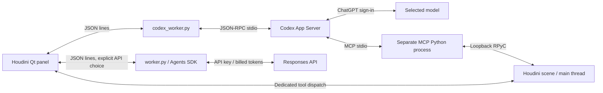

# Architecture and maintenance map

Reviewed against source on 27 September 2026. This describes the current local
preview; only Windows/Houdini 22 has been tested. Portable installation is supported
by generated local configuration and a verified dependency download.

## Process boundaries

Subscription is the initial default; restoring a chat restores its selected backend.
`codex_worker.py` launches the installed `codex app-server --listen stdio://`, checks
ChatGPT account type at connection and before turns, strips API-key environment
variables and rejects model substitution. `worker.py` runs the Agents SDK only for
the explicitly selected API backend; SDK tracing is disabled. These are independent
execution paths, not a fallback chain.

The UI owns a `QProcess` worker and serializes small JSON messages with protocol,
run and call identifiers. Main-thread dispatch keeps HOM/Qt access in Houdini.
Long cooks can still block the UI. Panel messages are capped at 2,000,000 bytes;
the native Codex stream has a separate 32,000,000-byte bound.

## Source map

| Files | Responsibility |
|---|---|
| `open_panel.py`, `panel_install.py`, `astra.pypanel` | Shelf entry point, portable template and generated ignored panel registration with the installation path. |
| `houdini-ai-assistant.json`, `toolbar/astra.shelf`, `scripts/build_plugin.py` | Native Houdini package/shelf and source-only ZIP assembly from the audited Git index. |
| `launch_ui.py`, `setup_ui.py`, `bootstrap.py` | First-run Qt setup, background verified dependency installation, remembered launch and Account recovery. |
| `account_worker.py`, `user_account.py`, `codex_paths.py` | Private-pipe account helper, native Codex browser login, API verification/DPAPI storage and executable discovery. |
| `astra_panel.py` | Qt UI, focus repair, worker lifecycle, saved-chat selection, context capture, dedicated tool dispatch, Stop/Undo and diagnostics. |
| `tool_contracts.py` | Protocol version, exact model IDs, base schemas/instructions; composes Solaris and texture contracts. |
| `codex_worker.py` | Subscription auth, App Server protocol, native/dynamic tool bridge, streaming, rate limits, resume and watchdogs. |
| `worker.py` | Agents SDK API streaming, tool routing, history checkpoints, limits and cancellation. |
| `scene_tools.py`, `apex_tools.py` | HOM discovery/edits, cooked geometry inspection and native APEX Scene Animate keys/layers. |
| `mcp_config.py`, `mcp_session.py` | Pinned vendor path, per-thread MCP config, panel-owned loopback listener and Houdini 22 RPyC compatibility shim. |
| `run_houdini_mcp.py`, `mcp_extensions.py` | External stdio MCP launch, tool auditing, legacy-tool disabling and custom Solaris/texture tools. |
| `solaris_contracts.py`, `solaris_tools.py`, `workflow_policy.py` | Shared lookdev schemas/rules, USD/LOP/MaterialX authoring and generic node-creation restrictions. |
| `render_jobs.py`, `render_job_worker.py` | Durable render manifests, private USD snapshot, hidden `husk` supervisor, previews and cancellation. |
| `texture_contracts.py`, `texture_paths.py`, `texture_assets.py`, `asset_worker.py` | Library/cache bounds, HTTPS downloads, procedural PNGs and non-HOM asset/render queries. |
| `uthana_client.py`, `uthana_worker.py`, `uthana_qt.py`, `uthana_scene.py` | Text-only Uthana API/cache, async Qt helper, downloaded FBX import and local biped/APEX retargeting. |
| `chat_store.py`, `diagnostics.py` | SQLite chat catalogue/leases and rotating redacted diagnostics. |
| `tests/unit/`, `tests/textures/`, `tests/integration/` | Offline unit tests and optional native/live integration checks; see development guide. |
| `install_mcp_source.py`, `setup*.ps1` | Signed Python environment setup and checksum-verified upstream source download. |
| `runtime_settings.py`, `local_settings.example.json` | Optional user texture configuration; actual local settings stay ignored. |
| `tests/support.py`, `tests/unit/test_packaging.py` | Test host discovery, synthetic fixtures and moved-checkout regression checks. |
| `vendor/houdini-mcp-7e5cd7a2484b899a6e9251c6f7b90228c2ec7990/` | Downloaded pinned upstream dependency, excluded from Git. |
| `panel.py`, `tests/integration/check_assistant.py` | Compatibility wrappers; edit the implementations they delegate to. |

## First-run installation and authentication

Houdini discovers the package JSON alongside the source folder and loads the shelf
definition. Its tool calls `open_panel.py`, then `launch_ui.launch()`. If dependency
fingerprints and per-user onboarding preferences are valid, it opens the panel and
queues a connection. Existing chats retain their original backend/model; there is
no automatic model turn. Otherwise a setup dialog prepares the account and runtime.

`SetupThread` performs installation without HOM calls. It uses a cross-process lease,
locked dependency lists and private environments. Missing Python/Codex runtimes are
downloaded from pinned official URLs, SHA-256 checked, and publisher-signature checked.
The marker is written after dependency checks succeed. Cancellation is honored between
steps, with downloads interruptible; Qt retains the dialog until its worker exits.
The main Houdini window owns setup so closing a panel cannot destroy a live installer.

After installation, `account_worker.py` runs in the external assistant interpreter.
Subscription setup initializes App Server, reads account state and, when needed,
uses `account/login/start` with type `chatgpt`. The UI opens the returned HTTPS auth
URL; a completed notification triggers another account read. Codex persists auth.
API setup sends a masked-field key through stdin, checks the models endpoint without
a model request, then encrypts the key using Windows DPAPI. Only verified setup is
remembered when the user clicks Open assistant. Neither flow changes billing mode
implicitly. The panel's Account button reopens this flow after stopping its worker.

The ZIP contains only audited source. It does not carry prepared runtimes, API keys,
Codex sessions, chats or source-ignored data. Setup on each machine prepares these
locally. The first release requires a writable Windows x64 installation folder.

## Tool execution and recovery

Dedicated scene actions pass through panel run/call IDs and scene-generation guards.
Duplicate calls reuse results; stopped or stale requests are rejected. Scene edits
use undo batches; an error can leave earlier operations applied. The panel's Undo
button handles the most recent dedicated Astra edit group. Native MCP edits can
require Houdini's ordinary Undo.

Subscription MCP uses a separate `.mcp-venv` process and a listener owned by the
current panel. Its bind address is explicitly loopback and Windows chooses the port.
Readiness requires a successful `get_scene_info` call, not merely a running process.
The `.port`/`.bound_port` shim adapts Houdini 22's bundled RPyC to upstream expectations.
No separate global server or startup hook is required. Last verified inventory: 46
tools, including ten project Solaris/texture additions; treat the live inventory as
authoritative when changing versions.

The native MCP path bypasses the panel's dedicated-call dispatcher, so do not claim
all dedicated duplicate/undo/cancellation guarantees cover arbitrary MCP execution.
Codex uses read-only shell sandboxing and untrusted approval policy; permitted external
tools can still edit scenes and write scoped assets. Workflow rules and upstream
`execute_code` checks are not a security sandbox for hostile code or another local user.
Never expose the RPyC listener to the network.

The turn deadline is 600 seconds of inactivity, not a fixed ten-minute turn duration.
Only relevant turn/item activity and tool results refresh it; stale events and account
heartbeats do not. Dedicated tool deadlines are 180 seconds, normal bridge RPCs 45
seconds, initial MCP scene checks 75 seconds; MCP config has startup/tool limits of
45/120 seconds. A timeout does not establish that an edit failed to run.

## Persistence and privacy

| Local storage | Contents and recovery implications |
|---|---|
| `%LOCALAPPDATA%/HoudiniAstra/` | Remembered backend and Windows DPAPI-encrypted API key; outside the install folder. Tests override with `HOUDINI_ASTRA_USER_DIR`. |
| `.local/` | Generated panel, dependency marker, setup log/downloads and optional Codex runtime; ignored installation state. |
| `.chat_history/chats.sqlite3` | SQLite WAL catalogue, transcript/draft, backend/model, scene path, Codex thread ID or API conversation items. OS chat leases prevent concurrent panel writers. |
| Codex's own session storage | Full subscription model history. Back up this and the chat catalogue; the visible transcript alone is insufficient. |
| `motion_cache/` | Uthana descriptions/settings, submission/job state and downloaded FBX. Referenced FBX must remain accessible to scenes. |
| `texture_cache/` | Downloaded/generated textures and source metadata. Keep referenced assets with projects. |
| `.render_jobs/` | Job state, private USD snapshots, previews and rendered outputs. Jobs can outlive the assistant turn. |
| `.logs/` | Per-process JSONL diagnostics, normally 2 MB plus two rotations. Old-file pruning is bounded; payload fields are excluded and credential-like errors redacted. |
| `.secrets/` | Optional local plain-text Uthana key and private machine files; never source or release content. |

Neither the chat catalogue nor secret files are encrypted by this application.
Scene context and tool results go to the selected model service. Uthana gets only
motion text/settings, not the target scene. Texture downloads do not upload scene
data. Raw integration-test stderr, render error tails and generated reports can still
contain personal paths or other private details; inspect before sharing.

With a `ChatStore`, subscription threads are durable; test bridges without a store
use ephemeral threads. Resume restores dynamic tools from the saved thread and
overrides instructions/MCP configuration with the current listener port. The adapter
does not send `dynamicTools` on resume. API mode checkpoints full conversation items
and pending input; its serialized-history guard asks for a new chat above 600,000
characters. A reopened chat receives fresh scene context and a recovery note before
new work. Loading/clearing a scene disconnects and saves the chat, not deletes history.
Saving a conversation does not save a `.hip` file.

## Rendering, animation and remaining limits

- Solaris/Karma XPU/MaterialX is a standing workflow requirement. Legacy upstream
  render/material helpers are disabled; generic node creation also checks policy.
  Failure must not select a different engine automatically.
- Working renders export a private current-frame snapshot capped at 960 pixels on
  the longest edge and 32 samples, with reduced bounces, no displacement, depth of
  field or motion blur. Original scene settings stay intact. WIP tools return image
  content; base64 text or geometry metadata alone is not visual inspection.
- Background renders need explicit job cancellation. Panel Stop cannot forcibly
  abort a running HOM cook or cancel an already accepted Uthana job. Unknown render
  states and uncertain motion submissions are not automatically restarted.
- APEX keys target exposed local rig inputs on editable override layers. No general
  auto-rigger, world-space IK solver or simulation system is supplied. Uthana biped
  retargeting can need manual mapping/rest-pose correction; local baking is capped
  at 601 frames. Motion clips currently span 4–10 seconds.
- Texture writing supplies simple procedural patterns, not an AI image generator.
  Texture assignment requires existing UVs and appropriate maps. Authenticated
  Fab/Megascans acquisition is not implemented; local libraries and authorized
  direct downloads are supported.
- Only Windows/Houdini 22.0.368 has been exercised. GUI focus/docking and visual
  animation quality need manual review. The earlier XPU smoke render reported an
  Optix/driver incompatibility: successful XPU execution did not verify GPU acceleration.

See [LOOKDEV_AND_DIAGNOSTICS.md](LOOKDEV_AND_DIAGNOSTICS.md) for render/texture
behavior and [DEVELOPMENT.md](DEVELOPMENT.md) for signed-Python startup troubleshooting.
